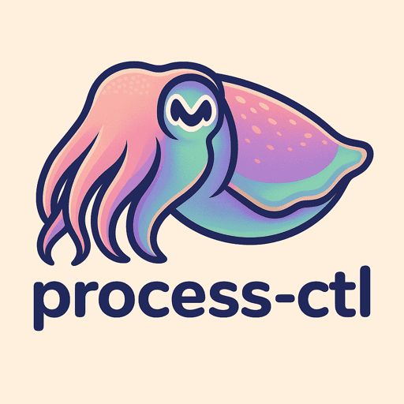

<div align="center">
  
</div>

<div align="center">


</div>

A single-script solution for unified process management across development teams. Pure bash, zero dependencies.

*Inspired by tools like [procdog](https://github.com/jlevy/procdog) that prioritize simplicity over enterprise complexity.*

## Quick Start

```bash
# Install to ~/bin (recommended)
curl https://raw.githubusercontent.com/mparrett/process-ctl/main/process-ctl > ~/bin/process-ctl
chmod +x ~/bin/process-ctl

# Add ~/bin to PATH if not already there
echo 'export PATH="$HOME/bin:$PATH"' >> ~/.bashrc

# Optional: Add convenient alias
echo 'alias pctl="process-ctl"' >> ~/.bashrc
source ~/.bashrc

# Configure your project
echo 'PROJECT_NAME="my-service"
START_CMD="python -m uvicorn main:app --port 8000"
PORT=8000' > .process-ctl-cfg

# Use
process-ctl start      # foreground
process-ctl start-bg   # background daemon
process-ctl status     # check status
process-ctl stop       # stop daemon
process-ctl logs       # view logs
process-ctl tail       # follow logs
```

## Features

- **Zero Dependencies** - Pure bash, works everywhere
- **Auto-Discovery** - Finds `.process-ctl-cfg` walking up directory tree
- **Robust Process Management** - PID files, port conflict detection, graceful shutdown
- **Simple Interface** - Same commands work across all projects
- **Safe Operation** - Stale PID cleanup, conflict prevention

## Configuration

Required in `.process-ctl-cfg`:
```bash
PROJECT_NAME="service-name"
START_CMD="your-start-command"
```

Optional:
```bash
PORT=8000           # Port conflict detection
LOG_MAX_SIZE="50M"  # Log rotation threshold
```

## Commands

- `start` - Start in foreground
- `start-bg` - Start as background daemon
- `stop` - Stop background service
- `restart` - Restart service
- `status` - Show service status
- `logs` - Show service logs
- `tail` - Show last 50 lines of logs
- `follow` - Follow logs in real-time

Files stored in `~/.cache/process-ctl/`

## Service Development Guidelines

### Signal Handling Best Practices

Process-ctl uses graceful shutdown with a 10-second timeout:
1. Sends `SIGTERM` to your service for graceful shutdown
2. Waits up to 10 seconds for clean exit
3. Falls back to `SIGKILL` if needed

**For optimal integration, your services should handle SIGTERM gracefully:**

#### Python Services
```python
import signal
import sys

def signal_handler(sig, frame):
    # Clean shutdown logic
    print("Received SIGTERM, shutting down gracefully...")
    # Close database connections, finish requests, save state
    sys.exit(0)

signal.signal(signal.SIGTERM, signal_handler)

# Your service code here
```

#### Node.js Services
```javascript
process.on('SIGTERM', () => {
    console.log('Received SIGTERM, shutting down gracefully...');
    // Close server, database connections, etc.
    server.close(() => {
        process.exit(0);
    });
});
```

#### Go Services
```go
func main() {
    c := make(chan os.Signal, 1)
    signal.Notify(c, syscall.SIGTERM)
    
    go func() {
        <-c
        log.Println("Received SIGTERM, shutting down gracefully...")
        // Cleanup logic
        os.Exit(0)
    }()
    
    // Your service code here
}
```

### Service Design Patterns

**Good practices for `START_CMD` services:**
- Handle SIGTERM for graceful shutdown
- Close database connections cleanly
- Finish processing current requests
- Save important state before exit
- Log shutdown activities
- Exit with code 0 on successful shutdown

See [workspace/incoming/DESIGN_SPEC.md](workspace/incoming/DESIGN_SPEC.md) for complete documentation.