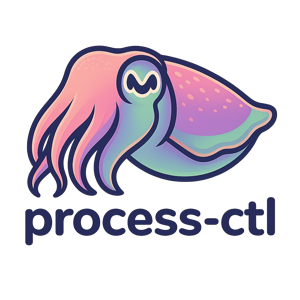

<div align="center">
  
</div>

<div align="center">


</div>

A single-script solution for unified process management across development teams. Pure bash, zero dependencies.

*Inspired by tools like [procdog](https://github.com/jlevy/procdog) that prioritize simplicity over enterprise complexity.*

## Quick Start

```bash
# Install
curl https://raw.githubusercontent.com/mparrett/process-ctl/main/process-ctl > ~/bin/process-ctl
chmod +x ~/bin/process-ctl

# Configure your project
echo 'PROJECT_NAME="my-service"
START_CMD="python -m uvicorn main:app --port 8000"
PORT=8000' > .process-ctl-cfg

# Use
process-ctl start      # foreground
process-ctl start-bg   # background daemon
process-ctl status     # check status
process-ctl stop       # stop daemon
process-ctl logs       # view logs
process-ctl tail       # follow logs
```

## Features

- **Zero Dependencies** - Pure bash, works everywhere
- **Auto-Discovery** - Finds `.process-ctl-cfg` walking up directory tree
- **Robust Process Management** - PID files, port conflict detection, graceful shutdown
- **Simple Interface** - Same commands work across all projects
- **Safe Operation** - Stale PID cleanup, conflict prevention

## Configuration

Required in `.process-ctl-cfg`:
```bash
PROJECT_NAME="service-name"
START_CMD="your-start-command"
```

Optional:
```bash
PORT=8000           # Port conflict detection
LOG_MAX_SIZE="50M"  # Log rotation threshold
```

## Commands

- `start` - Start in foreground
- `start-bg` - Start as background daemon
- `stop` - Stop background service
- `restart` - Restart service
- `status` - Show service status
- `logs` - Show service logs
- `tail` - Show last 50 lines of logs
- `follow` - Follow logs in real-time

Files stored in `~/.cache/process-ctl/`

See [docs/DESIGN_SPEC.md](docs/DESIGN_SPEC.md) for complete documentation.